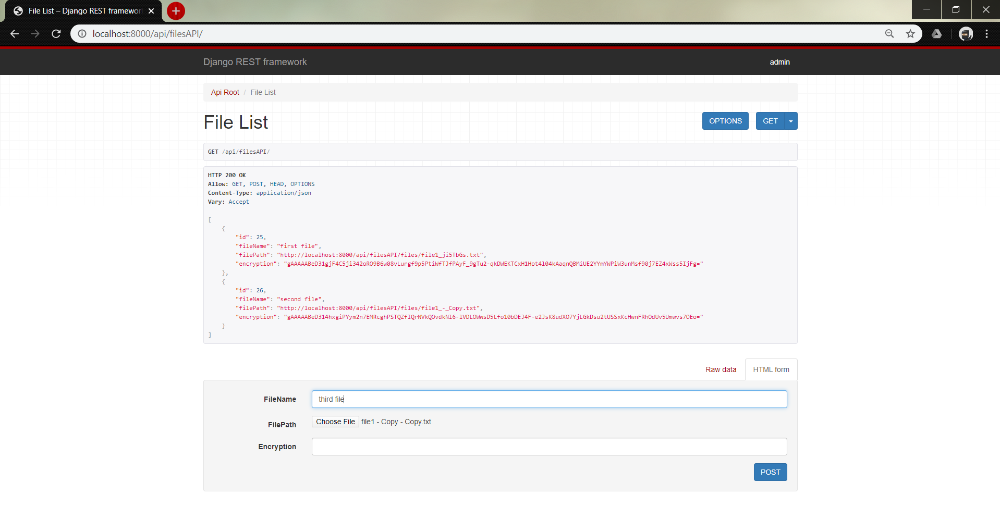
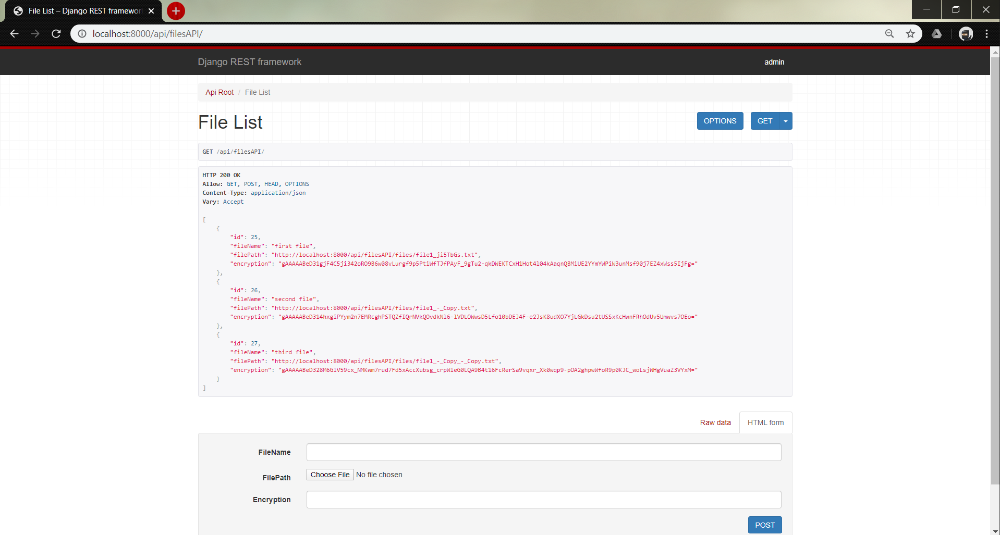

# Convin Assingment

1. Create a model having fields of type CharField and FileField. Implement a system on top of this model which should notify the updated/created field only and its old and new value. (it shouldn’t notify about the field which is not updated). It should also notify in case content of FileField is changed. [You may use signals or any other mechanism of your choice.] 

2. Now suppose CharField is the encrypted value of the content of FileFIeld (or you can choose any heavy computation of your choice on the content of File(it may be just along for loop)). Implement a system which allows updating FileField content by an external party (for example invoking management command from bash or calling a Django API or your choice of making it accessible by an external party). Note: after FileField content is changed, it should notify the updated value of FileField and CharField

## Files dispay page
All files are pulled from the database and displayed here. 

## Upload new file page
This is the upload page which gives the functionality to upload the new files. 

As viewed in the picture below, the user is notified of the uploaded file. 

## Update file page
This can be accessed from the all files page and either the name of the file or the content can be changed. 

The update confirmation is received via a alert message. 

## Delete functionality
Delete functionality is accessed through the all files page itself and the user is notified of the change

## Encryption and REST 
The encryption used is Fernet from djnago-cryptography package. This encryption in the following images has been shown through the Django rest framework api. An example of uploading a file via POST and viewign all the files via GET method is also shown. 

