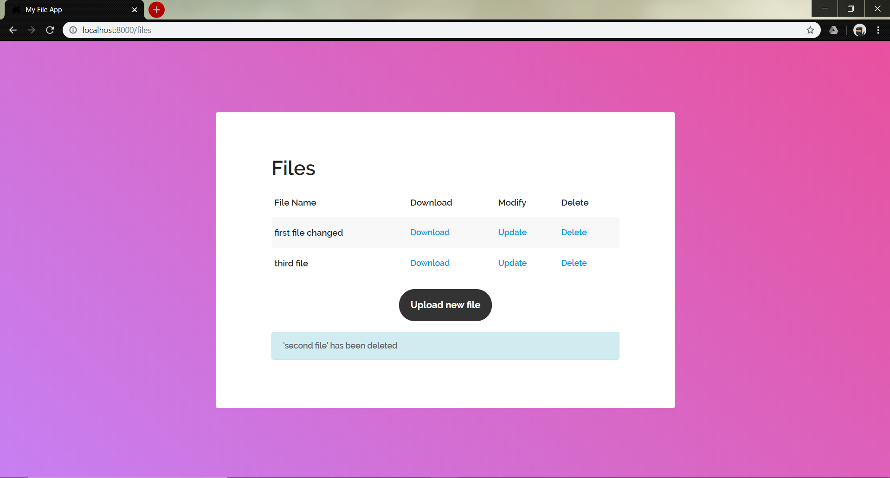

# Convin Assingment
## Files dispay page
All files are pulled from the database and displayed here. 

## Upload new file page
This is the upload page which gives the functionality to upload the new files. 

As viewed in the picture below, the user is notified of the uploaded file. 

## Update file page
This can be accessed from the all files page and either the name of the file or the content can be changed. 

The update confirmation is received via a alert message. 

## Delete functionality
Delete functionality is accessed through the all files page itself and the user is notified of the change

## Encryption and REST 
The encryption used is Fernet from djnago-cryptography package. This encryption in the following images has been shown through the Django rest framework api. An example of uploading a file via POST and viewign all the files via GET method is also shown. 

